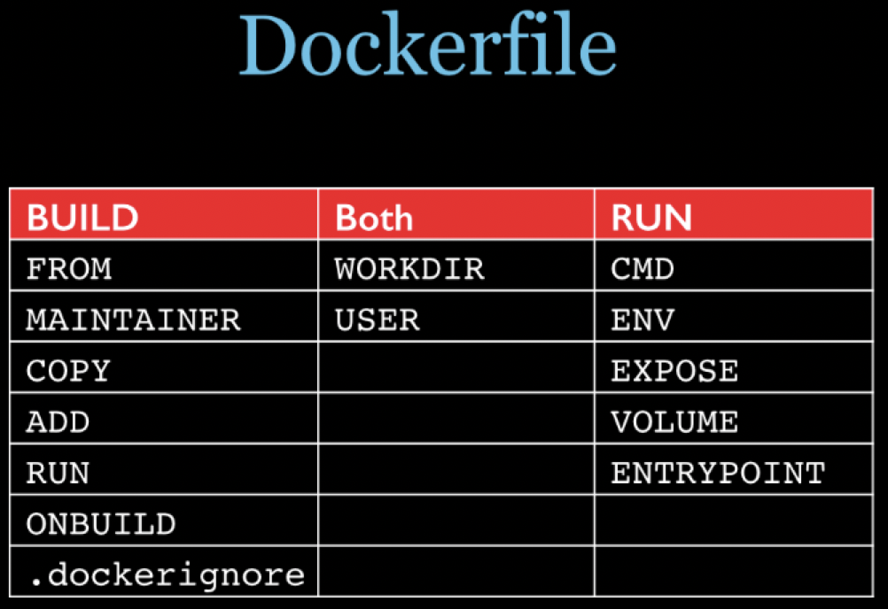
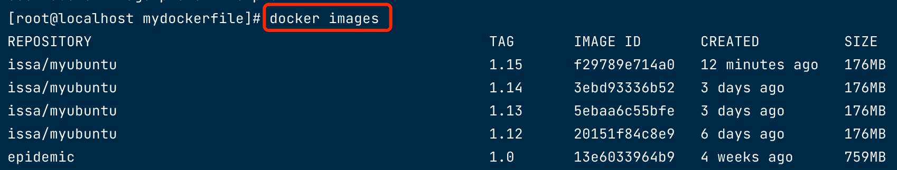
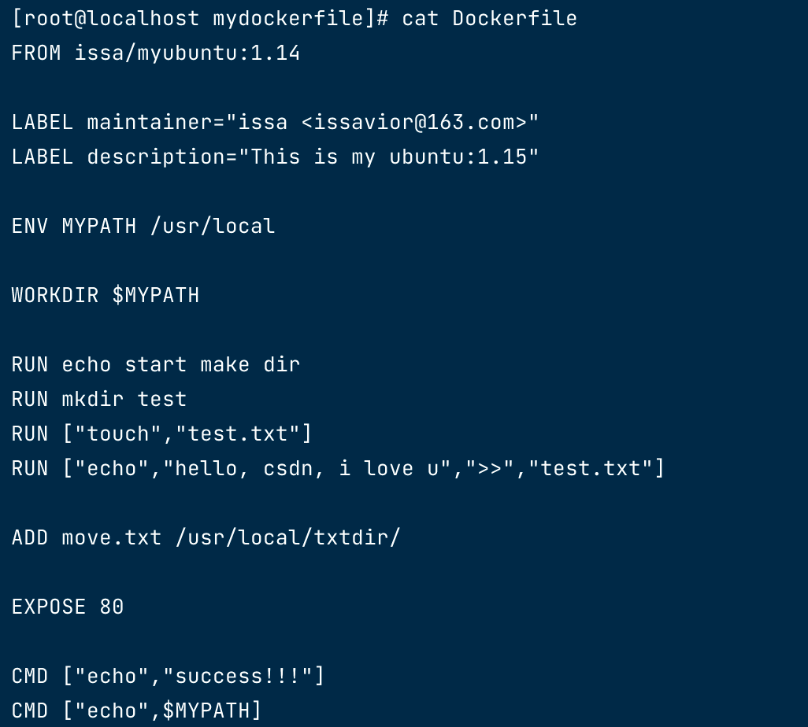
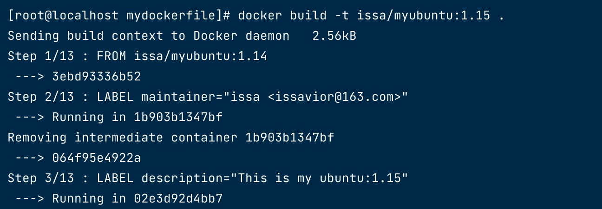
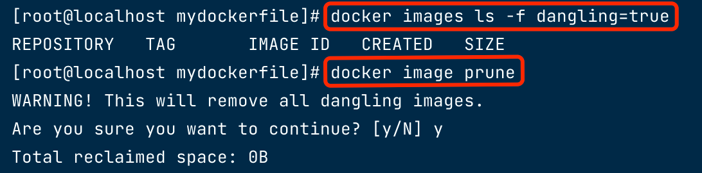
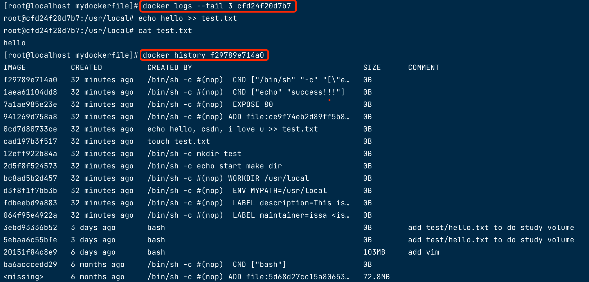

## 一、初识

### 1.1 简介

Dockerfile是用来构建Docker镜像的构建文件，是由一系列命令和参数构成的脚本。

### 1.2 构建三步骤

1. 编写Dockerfile文件
2. docker build
3. docker run


## 二、DockerFile构建过程解析
   
### 2.1 Dockerfile内容基础知识

1. 每条保留字指令都必须为大写字母且后面要跟随至少一个参数
2. 指令按照从上到下，顺序执行
3. #表示注释
4. 几乎每条指令都会创建一个新的镜像层，并对镜像进行提交
```text
Dockerfile中的以下指令会执行时会创建新的镜像层：
1. ADD
2. COPY
3. RUN
4. FROM
5. VOLUME
6. USER
7. HEALTHCHECK
8. SHELL
```
   
### 2.2 Docker执行Dockerfile流程

1. docker从基础镜像运行一个容器
2. 执行一条指令并对容器作出修改
3. 执行类似docker commit的操作提交一个新的镜像层
4. docker再基于刚提交的镜像运行一个新容器
5. 执行dockerfile中的下一条指令直到所有指令都执行完成
   
### 2.3 Dockerfile相关

从应用软件的角度来看，Dockerfile、Docker镜像与Docker容器分别代表软件的三个不同阶段：

- Dockerfile是软件的原材料
> Dockerfile，需要定义一个Dockerfile，Dockerfile定义了进程需要的一切东西。Dockerfile涉及的内容包括执行代码或者是文件、环境变量、依赖包、运行时环境、动态链接库、操作系统的发行版、服务进程和内核进程(当应用进程需要和系统服务和内核进程打交道，这时需要考虑如何设计namespace的权限控制)等等;

- Docker镜像是软件的交付品
> Docker镜像，在用Dockerfile定义一个文件之后，docker build时会产生一个Docker镜像，当运行 Docker镜像时，会真正开始提供服务;

- Docker容器则可以认为是软件的运行态
> Docker容器，容器是直接提供服务的。

Dockerfile面向开发，Docker镜像成为交付标准，Docker容器则涉及部署与运维，三者缺一不可，合力充当Docker体系的基石。

  
## 三、DockerFile体系结构(保留字指令)



### 3.1 FROM

初始化一个新的构建阶段，并设置基础映像【当前新镜像是基于哪个镜像的】:

- FROM [--platform=<platform>] <image> [AS <name>]
- FROM [--platform=<platform>] <image> [:<tag>]    [AS <name>]
- FROM [--platform=<platform>] <image> [@<digest>] [AS <name>]

1. 单个dockfile可以多次出现 FROM ，以使用之前的构建阶段作为另一个构建阶段的依赖项
2. AS name表示为构建阶段命名，在后续FROM和COPY --from=说明中可以使用这个名词，引用此阶段构建的映像
3. digest其实就是就是根据镜像内容产生的一个ID，只要镜像的内容不变digest也不会变
4. tag或digest值是可选的。如果您省略其中任何一个，构建器默认使用一个latest标签。如果找不到该tag值，构建器将返回错误。
5. –platform标志可用于在FROM引用多平台镜像的情况下指定平台。例如，linux/amd64、linux/arm64、 或windows/amd64
   
### 3.2 MAINTAINER

专门用于描述该镜像的维护人信息，但是现在已经不建议使用了，统一使用LABEL
   
### 3.3 LABEL

添加元数据:
```shell
LABEL maintainer="zhangshan <zhangshan@163.com>"
LABEL description="This is my ubuntu"
```

### 3.3 RUN

将在当前镜像之上的新层中执行命令，在 docker build时运行【容器构建时需要运行的命令】:
```shell
 RUN /bin/bash -c 'echo hello,myubuntu'
```
RUN有两种形式：

1. RUN （shell 形式，命令在 shell 中运行，默认/bin/sh -c在 Linux 或cmd /S /CWindows 上）

2. RUN [“executable”, “param1”, “param2”]（执行形式）
   
说明：

- 可以使用\（反斜杠）将单个 RUN 指令延续到下一行
- RUN在下一次构建期间，指令缓存不会自动失效。可以使用–no-cache标志使指令缓存无效
- Dockerfile 的指令每执行一次都会在 docker 上新建一层。所以过多无意义的层，会造成镜像膨胀过大，可以使用&& 符号连接命令，这样执行后，只会创建 1 层镜像
   
### 3.4 EXPOSE
   
当前容器对外暴露出的端口:
```shell
EXPOSE <port> [<port>/<protocol>...]
```   
Docker 容器在运行时侦听指定的网络端口。可以指定端口是监听TCP还是UDP，如果不指定协议，默认为TCP。 该EXPOSE指令实际上并未发布端口。要在运行容器时实际发布端口，docker run -P 来发布和映射一个或多个端口。
默认情况下，EXPOSE假定 TCP，还可以指定 UDP：
```shell
EXPOSE 80/udp
```

### 3.5 WORKDIR

指定在创建容器后，终端默认登陆的进来工作目录，一个落脚点
   
工作目录，如果WORKDIR不存在，即使它没有在后续Dockerfile指令中使用，它也会被创建。
   
docker build 构建镜像过程中，每一个 RUN 命令都会新建一层。只有通过 WORKDIR 创建的目录才会一直存在。
   
可以设置多个WORKDIR，如果提供了相对路径，它将相对于前一条WORKDIR指令的路径。

例如：
```shell
WORKDIR /a
WORKDIR b
WORKDIR c
RUN pwd
```
最终pwd命令的输出是/a/b/c.

该WORKDIR指令可以解析先前使用 ENV，例如：
```shell
ENV DIRPATH=/path
WORKDIR $DIRPATH/$DIRNAME
RUN pwd
```
最终pwd命令的输出是 /path/$DIRNAME
   
### 3.6 变量

变量用 $variable_name 或者 ${variable_name} 表示

- ${variable:-word}表示如果variable设置，则结果将是该值。如果variable未设置，word则将是结果。

- ${variable:+word}表示如果variable设置则为word结果，否则为空字符串。
   
- 变量前加\可以转义成普通字符串：\$fooor\${foo}，表示转换为$foo和${foo}文字。

### 3.7 ENV

用来在构建镜像过程中设置环境变量
```shell
ENV <key>=<value> ...
```
设置的环境变量将持续存在，您可以使用docker inspect来查看。使用docker run --env <key>=<value>来更改环境变量的值。
```shell
ENV MY_PATH /usr/mytest
```   
这个环境变量可以在后续的任何RUN指令中使用，这就如同在命令前面指定了环境变量前缀一样；
   
也可以在其它指令中直接使用这些环境变量,比如：WORKDIR $MY_PATH
   
如果环境变量只在构建期间需要，请考虑为单个命令设置一个值：
```shell
RUN DEBIAN_FRONTEND=noninteractive apt-get update && apt-get install -y ...
```
或者使用ARG，它不会保留在最终镜像中：
```shell
ARG DEBIAN_FRONTEND=noninteractive
RUN apt-get update && apt-get install -y ...
```

### 3.8 ARG
   
定义变量，与ENV 作用相同，不过ARG变量不会像ENV变量那样持久化到构建好的镜像中。

```shell
ARG <name>[=<default value>]
```
Docker 有一组预定义的ARG变量，您可以在 Dockerfile 中没有相应指令的情况下使用这些变量。
```shell
HTTP_PROXY
http_proxy
HTTPS_PROXY
https_proxy
FTP_PROXY
ftp_proxy
NO_PROXY
no_proxy
```   
要使用这些，请使用–build-arg标志在命令行上传递它们，例如：
```shell
docker build --build-arg HTTPS_PROXY=https://my-proxy.example.com .
```
   
### 3.9 ADD
   
将宿主机目录下的文件拷贝进镜像且ADD命令会自动处理URL和解压tar压缩包,复制新文件、目录或远程文件 URL ，并将它们添加到中。
   
可以指定多个资源，但如果它们是文件或目录，则它们的路径被解释为相对于构建上下文的源，也就是WORKDIR。
   
每个都可能包含通配符，匹配将使用 Go 的 filepath.Match规则。例如：
   
添加所有以“hom”开头的文件：
```shell
ADD hom* /mydir/
```   
在下面的示例中，?被替换为任何单个字符，例如“home.txt”。

```shell
ADD hom?.txt /mydir/
```
是一个绝对路径，或相对WORKDIR的相对路径。

### 3.10 COPY

类似ADD，拷贝文件和目录到镜像中。

将从构建上下文目录中 <源路径> 的文件/目录复制到新的一层的镜像内的 <目标路径> 位置
   
语法同ADD一致，复制拷贝文件。
   
COPY指令和ADD指令的唯一区别在于：是否支持从远程URL获取资源。COPY指令只能从执行docker build所在的主机上读取资源并复制到镜像中。而ADD指令还支持通过URL从远程服务器读取资源并复制到镜像中。
   
相同需求时，推荐使用COPY指令。ADD指令更擅长读取本地tar文件并解压缩。
   
### 3.11 VOLUME
   
容器数据卷，用于数据保存和持久化工作
   
创建一个具有指定名称的挂载数据卷:

```shell
VOLUME ["/var/log/"]
VOLUME /var/log
```
它的主要作用是：
   
- 避免重要的数据，因容器重启而丢失
- 避免容器不断变大
   
### 3.12 CMD
   
指定一个容器启动时要运行的命令
   
Dockerfile 中可以有多个 CMD 指令，但只有最后一个生效，CMD 会被 docker run 之后的参数替换
   
运行程序，在docker run 时运行，但是和run命令不同，RUN 是在 docker build时运行
```shell
FROM ubuntu
CMD ["/usr/bin/wc","--help"]
```   

支持三种格式:

- CMD [“executable”,“param1”,“param2”] 使用 exec 执行，推荐方式；
- CMD command param1 param2 在 /bin/sh 中执行，提供给需要交互的应用；
- CMD [“param1”,“param2”] 提供给 ENTRYPOINT 的默认参数；
   
指定启动容器时执行的命令，每个 Dockerfile 只能有一条 CMD 命令。如果指定了多条命令，只有最后一条会被执行。
   
如果用户启动容器时候指定了运行的命令，则会覆盖掉 CMD 指定的命令。

   
### 3.13 ENTRYPOINT
   
指定一个容器启动时要运行的命令
   
ENTRYPOINT 的目的和 CMD 一样，都是在指定容器启动程序及参数
   
不过它不会被 docker run 的命令行参数指定的指令所覆盖。如果要覆盖的话，需要通过docker run --entrypoint 来指定。
   
它有2种格式：

```shell
ENTRYPOINT ["executable", "param1", "param2"]
ENTRYPOINT command param1 param2
```
当指定了 ENTRYPOINT 后， CMD 的内容作为参数传给 ENTRYPOINT 指令，实际执行时，将变为：
   
### 3.14 ONBUILD
   
当构建一个被继承的Dockerfile时运行命令，父镜像在被子继承后父镜像的onbuild被触发
   
将一个触发指令添加到镜像中，以便稍后在该镜像用作另一个构建的基础时执行。也就是另外一个dockerfile FROM了这个镜像的时候执行。

```shell
ONBUILD ADD . /app/src
ONBUILD RUN /usr/local/bin/python-build --dir /app/src
```   

### 3.15 STOPSIGNAL
   
设置将发送到容器退出的系统调用信号
   
该信号可以是与内核系统调用表中的位置匹配的有效无符号数，例如 9，或格式为 SIGNAME 的信号名称，例如 SIGKILL。
```shell
STOPSIGNAL signal
```   
默认的 stop-signal 是 SIGTERM，在docker stop的时候会给容器内PID为1的进程发送这个signal，通过–stop-signal 可以设置自己需要的signal，主要目的是为了让容器内的应用程序在接收到signal之后可以先处理一些事物，实现容器的平滑退出，如果不做任何处理，容器将在一段时间之后强制退出，会造成业务的强制中断，默认时间是10s。
   
### 3.16 HEALTHCHECK
   
用于指定某个程序或者指令来监控 docker 容器服务的运行状态
   
该HEALTHCHECK指令有两种形式：

- HEALTHCHECK [OPTIONS] CMD command （通过在容器内运行命令来检查容器健康状况）
- HEALTHCHECK NONE （禁用从基础镜像继承的任何健康检查）
   
### 3.17 SHELL
   
覆盖用于命令的shell 形式的默认 shell
   
Linux 上的默认 shell 是[“/bin/sh”, “-c”]，Windows 上是[“cmd”, “/S”, “/C”]
   
SHELL ["executable", "parameters"]
   
该SHELL指令在 Windows 上特别有用，因为 Windows 有两种常用且截然不同的本机 shell：cmd和powershell，以及可用的备用 shell，包括sh。该SHELL指令可以出现多次。每条SHELL指令都会覆盖所有先前的SHELL指令，并影响所有后续指令。
   
### 3.18 USER
   
设置用户名（或 UID）和可选的用户组（或 GID）

```shell
USER <user>[:<group>]
USER <UID>[:<GID>]
```

## 四、实战：制作自己的ubuntu
   
如果一直跟着我的docker系列学习，相比你的电脑里已经有了如下镜像
   
1. 输入docker images，查看我们已经有的镜像:


   
2. 新建一个文件夹mydockerfile，用来存放我们的镜像文件Dockerfile

   
3. 输入vim Dockerfile，开始制作我们的镜像



   
4. 输入touch move.txt
   
5. 最后，输入 docker build -t issa/myubuntu:1.15 .




## 小知识：
   
查看和处理虚悬镜像:



查看日志以及查看历史:




## 五、推送本地镜像到Dockerhub

1. 登录dockerhub

```shell
docker login
```

2. 标记镜像

```shell
docker tag local_image_name:tag docker_hub_username/repository_name:tag
```

3. 推送到dockerhub

```shell
docker push docker_hub_username/repository_name:tag
```

4. 退出登录

```shell
docker logout
```