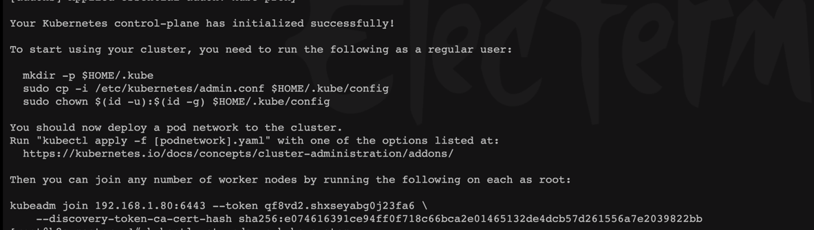

## 一、准备工作

准备三台虚拟机，centos7系统

## 二、系统配置

### 1. 修改主机名

```shell
# 三台机器都需要执行
hostnamectl set-hostname k8s-master
hostnamectl set-hostname k8s-node1
hostnamectl set-hostname k8s-node2
```
### 2. 修改hosts文件

```shell
# 三台机器都需要执行
[root@k8s-master ~]# vim /etc/hosts
192.168.10.129 k8s-master
192.168.10.134 k8s-node1
192.168.10.136 k8s-node2
```
### 3. 关闭防火墙和SELinux

```shell
# 三台机器都需要执行
[root@k8s-master ~]# setenforce 0 
[root@k8s-node1 ~]# systemctl stop firewalld.service 
[root@k8s-node1 ~]# systemctl disable firewalld.service
```
### 4. 关闭swap
> 注释 /dev/mapper/rhel-swap这一行
```shell
# 三台机器都需要执行
[root@k8s-master ~]# vim /etc/fstab 
#/dev/mapper/rhel-swap   none                    swap    defaults        0 0
```

### 5.修改网卡配置
```shell
# 三台机器都需要执行
[root@k8s-master ~]# vim /etc/sysctl.d/kubernetes.conf
net.bridge.bridge-nf-call-ip6tables = 1
net.bridge.bridge-nf-call-iptables = 1
net.ipv4.ip_forward = 1

[root@k8s-master ~]# sysctl --system
```

### 6. 系统模块配置
```shell
# 三台机器都需要执行
[root@k8s-master ~]# modprobe br_netfilter    #加载系统模块
[root@k8s-master ~]# lsmod | grep br_netfilter
```

### 7. 免密登录

```shell
# 三台机器都需要执行
[root@k8s-master ~]ssh-keygen 
[root@k8s-master ~]ssh-copy-id root@192.168.10.129
[root@k8s-master ~]ssh-copy-id root@192.168.10.134
[root@k8s-master ~]ssh-copy-id root@192.168.10.136
```

### 8. 更新并安装依赖
```shell
# 三台机器都需要执行
yum -y update
yum install -y conntrack ipvsadm ipset jq sysstat curl iptables libseccomp
```

### 9.同步时间
```shell
# 三台机器都需要执行
yum install ntpdate -y
ntpdate time.windows.com
```

## 三、下载相关软件

### 1. 安装docker(所有机器)
```shell
# 1、卸载系统之前的 docker（如果装过的话）
sudo yum remove docker \
	docker-client \
	docker-client-latest \
	docker-common \
	docker-latest \
	docker-latest-logrotate \
	docker-logrotate \
	docker-engine

# 2、安装必要依赖
sudo yum install -y yum-utils device-mapper-persistent-data lvm2

# 3、设置 docker repo 的 yum 位置
sudo yum-config-manager \
    --add-repo \
    http://mirrors.aliyun.com/docker-ce/linux/centos/docker-ce.repo
# 4、更新yum软件包索引
yum makecache fast

# 5、安装docker（指定版本）
sudo yum install -y docker-ce-18.09.0 docker-ce-cli-18.09.0 containerd.io

# 6、启动docker并设置开机启动
sudo systemctl start docker && sudo systemctl enable docker

# 7、设置阿里云的docker镜像加速
sudo mkdir -p /etc/docker
sudo tee /etc/docker/daemon.json <<-'EOF'
{
"registry-mirrors": ["https://t3irn0eu.mirror.aliyuncs.com"]
}
EOF
# 重启服务器
sudo systemctl daemon-reload
sudo systemctl restart docker

# 8、测试docker安装是否成功
sudo docker -v

```

### 2. 安装kubelet、kubeadm、kubectl（所有机器）

#### 下载和配置
```shell
#1. 配置yum源
cat <<EOF > /etc/yum.repos.d/kubernetes.repo
[kubernetes]
name=Kubernetes
baseurl=http://mirrors.aliyun.com/kubernetes/yum/repos/kubernetes-el7-x86_64
enabled=1
gpgcheck=0
repo_gpgcheck=0
gpgkey=http://mirrors.aliyun.com/kubernetes/yum/doc/yum-key.gpg
       http://mirrors.aliyun.com/kubernetes/yum/doc/rpm-package-key.gpg
EOF

#2. 安装kubernetes依赖
yum install -y kubernetes-cni-0.7.5-0

#3. 安装 kubelet
##kubelet要先安装再安装kubeadm和kubectl，如果已经安装一起安装了可以先yum -y remove kubelet
yum install -y kubelet-1.14.0-0

#4. 安装kubeadm和kubectl（所有机器）
yum install -y kubeadm-1.14.0-0 kubectl-1.14.0-0

#5. docker和k8s设置同一个cgroup
# 打开daemon.json
vi /etc/docker/daemon.json
# 追加
"exec-opts": ["native.cgroupdriver=systemd"],
# 重启docker
systemctl restart docker

#6. 配置kubelet（报：“`sed：无法读取10-kubeadm.conf：没有那个文件或目录`”，不用管，正常情况）
[root@localhost ~]# sed -i "s/cgroup-driver=systemd/cgroup-driver=cgroupfs/g" /etc/systemd/system/kubelet.service.d/10-kubeadm.conf

#7. 启动kubelet，并设置开机启动kubelet
[root@localhost ~]# systemctl enable kubelet && systemctl restart kubelet


```

#### 创建kubeadm.sh脚本，用于拉取镜像/打tag/删除原有镜像
```shell
#!/bin/bash
set -e
KUBE_VERSION=v1.14.0
KUBE_PAUSE_VERSION=3.1
ETCD_VERSION=3.3.10
CORE_DNS_VERSION=1.3.1

GCR_URL=k8s.gcr.io
ALIYUN_URL=registry.cn-hangzhou.aliyuncs.com/google_containers

images=(kube-proxy:${KUBE_VERSION}
kube-scheduler:${KUBE_VERSION}
kube-controller-manager:${KUBE_VERSION}
kube-apiserver:${KUBE_VERSION}
pause:${KUBE_PAUSE_VERSION}
etcd:${ETCD_VERSION}
coredns:${CORE_DNS_VERSION})

for imageName in ${images[@]} ; do
  docker pull $ALIYUN_URL/$imageName
  docker tag  $ALIYUN_URL/$imageName $GCR_URL/$imageName
  docker rmi $ALIYUN_URL/$imageName
done

```
```shell
# 执行脚本
chmod +x kubeadm.sh
./kubeadm.sh

# 查看镜像
docker images
```

## 四、初始化massre(只在主节点操作)

### kubeadm init
```shell
# kubernetes-version：版本
# apiserver-advertise-address：主节点ip；
# pod-network-cidr：pod的ip，可以不指定，没什么影响
kubeadm init --kubernetes-version=1.14.0 --apiserver-advertise-address=192.168.56.100 --pod-network-cidr=10.244.0.0/16
# 注意【若要重新初始化集群状态：kubeadm reset，然后再进行上述操作】

```
### 子节点加入集群
master初始化完成后，会输出以下内容：


上面命令在各个node上执行，将节点加入集群

```shell
kubeadm join 192.168.1.80:6443 --token qf8vd2.shxseyabg0j23fa6 \
    --discovery-token-ca-cert-hash sha256:e074616391ce94ff0f718c66bca2e01465132de4dcb57d261556a7e2039822bb 
```

### 日志中的这三条命令需要在主节点执行一下
```shell
# 日志中的这三条命令需要在主节点执行一下
mkdir -p $HOME/.kube
sudo cp -i /etc/kubernetes/admin.conf $HOME/.kube/config
sudo chown $(id -u):$(id -g) $HOME/.kube/config
```
### 查看集群信息、pod运行情况

```shell
# 查看集群信息
[root@master-kubeadm-k8s ~]# kubectl cluster-info
Kubernetes master is running at https://192.168.56.100:6443
KubeDNS is running at https://192.168.56.100:6443/api/v1/namespaces/kube-system/services/kube-dns:dns/proxy
To further debug and diagnose cluster problems, use 'kubectl cluster-info dump'.

# 运行在主节点的组件情况，我们看到有的在Running，有的正在准备
[root@master-kubeadm-k8s ~]# kubectl get pods -n kube-system
NAME                        READY   STATUS    RESTARTS   AGE
coredns-fb8b8dccf-jm4fj     0/1     Pending   0          6m18s
coredns-fb8b8dccf-qwlnj     0/1     Pending   0          6m18s
etcd-m                      1/1     Running   0          5m36s
kube-apiserver-m            1/1     Running   0          5m23s
kube-controller-manager-m   1/1     Running   0          5m28s
kube-proxy-mjmp9            1/1     Running   0          6m18s
kube-scheduler-m            1/1     Running   0          5m20s

```
我们发现coredns没有启动，需要安装网络插件。
```shell
# 健康检查
[root@master-kubeadm-k8s ~]# curl -k https://localhost:6443/healthz
ok

```

一定确保全部Running状态，再安装网络插件！（除了前两个）

```shell
# 在k8s中安装calico
kubectl apply -f https://docs.projectcalico.org/v3.9/manifests/calico.yaml

# 确认一下calico是否安装成功
kubectl get pods --all-namespaces -w

```

多等一会，我们发现，所有的pod都是Running状态了。

### 在master节点上检查集群信息

```shell
[root@m ~]# kubectl get nodes
NAME   STATUS   ROLES    AGE     VERSION
m      Ready    master   15h     v1.14.0
w1     Ready    <none>   7m5s    v1.14.0
w2     Ready    <none>   6m55s   v1.14.0


```

## 体验

### 部署一个nginx svc
```shell
kubectl create deployment nginx --image=nginx
$  $ kubectl get pod,svc
```

### 映射端口
```shell
kubectl expose deployment nginx --port=80 --type=NodePort
```
### 查询pod
```shell
[root@k8s-master ~]# kubectl get pod,svc
NAME                         READY   STATUS    RESTARTS   AGE
pod/nginx-65f88748fd-crc89   1/1     Running   0          18m

NAME                 TYPE        CLUSTER-IP       EXTERNAL-IP   PORT(S)        AGE
service/kubernetes   ClusterIP   10.96.0.1        <none>        443/TCP        95m
service/nginx        NodePort    10.105.250.145   <none>        80:30306/TCP   14m
```

### 访问页面

任意一个节点的ip:30306 即可进入nginx初始页面


